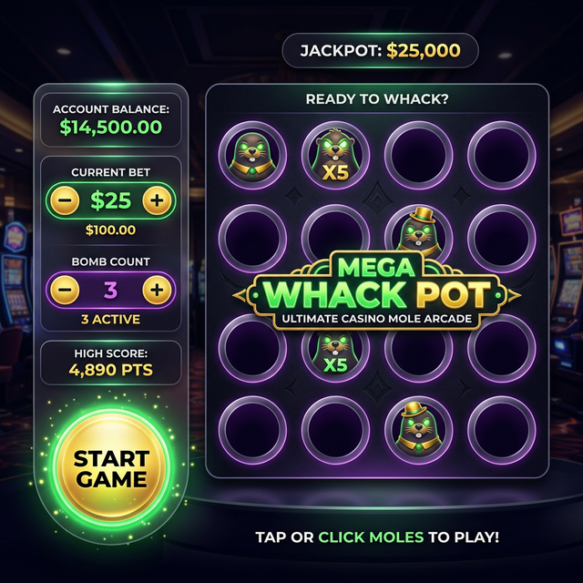
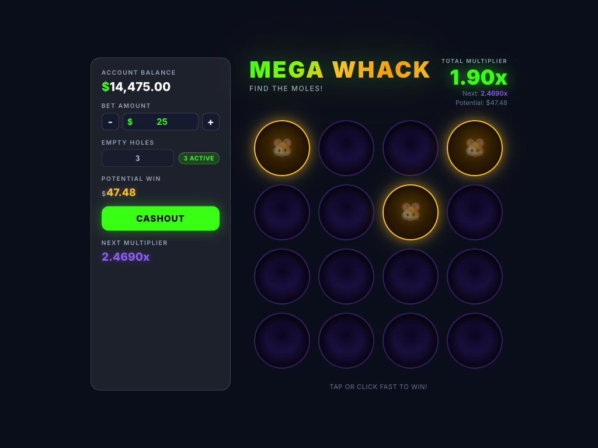
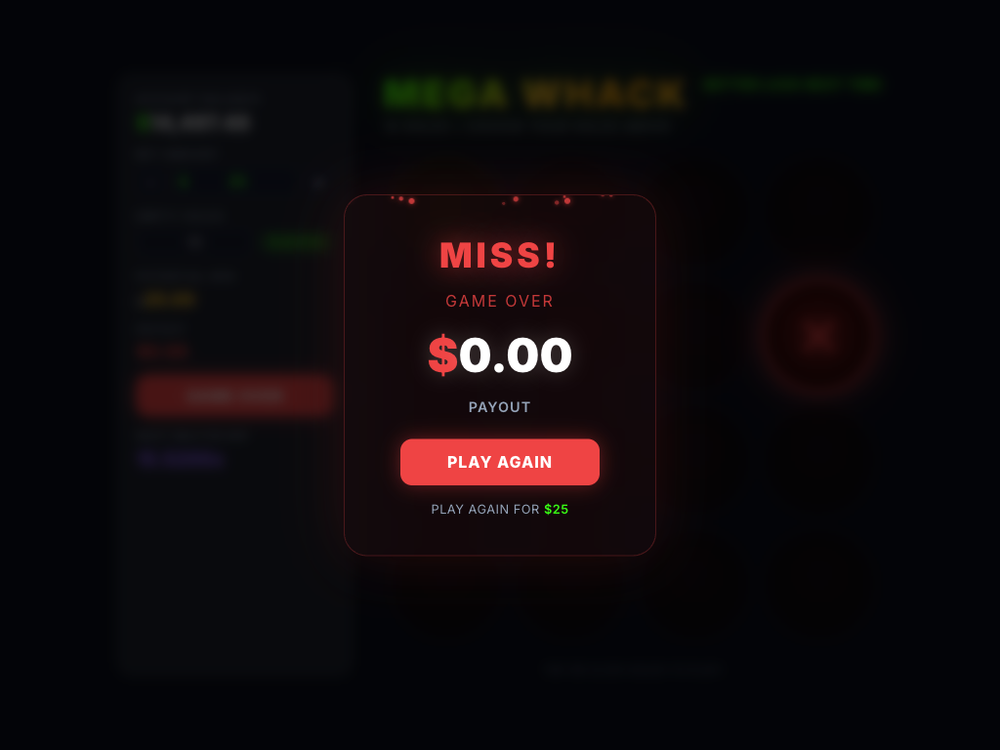
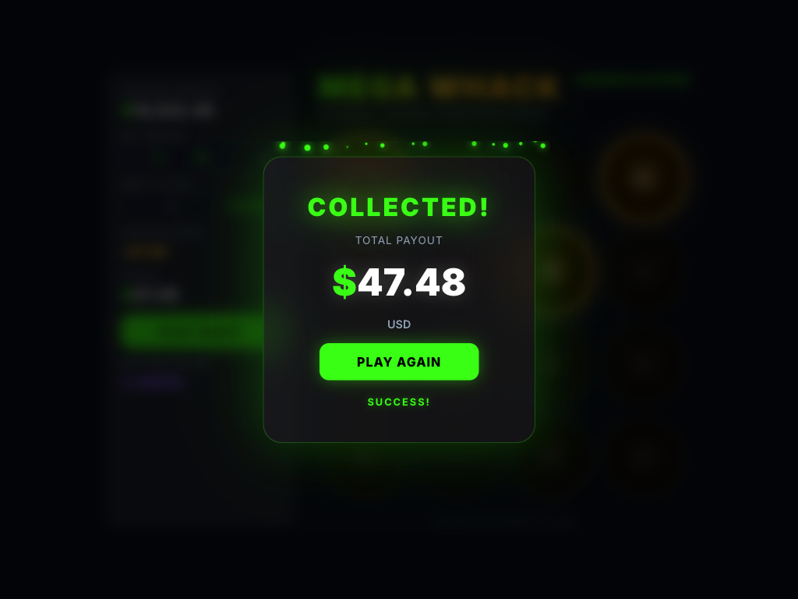

# 打地鼠機率遊戲 UI 原型 (Mockups) 展示

本文件展示了打地鼠遊戲 (Mega Whack) 的 4 個關鍵 UI 狀態原型。所有設計採用 **Premium Casino / Dark Mode / Glassmorphism** 風格。

## 1. 遊戲啟動畫面 (Start Screen)
玩家設置下注與空洞數量的初始畫面。左側控制面板含餘額、下注金額、空洞數選擇器。中央為 4x4 深色隧道風格洞口網格。

---

## 2. 遊戲進行中 - 擊中地鼠 (Mole Whacked)
展示成功擊中地鼠後的狀態。命中的洞口顯示金色地鼠與金色光環，右上角即時更新「TOTAL MULTIPLIER」倍率。

---

## 3. 敲中空洞畫面 - 遊戲結束 (Miss! Game Over)
打到空洞即 Game Over。中央彈出紅色 Glassmorphism 卡片顯示 **「MISS! GAME OVER」** 與 $0.00 Payout，紅色粒子效果與螢幕閃屏。

---

## 4. 結算畫面 - 成功獲利 (Cashout Success)
玩家選擇兌現時的勝利畫面。綠色 Glassmorphism 卡片顯示 **「COLLECTED!」** 與總獎金金額，綠色粒子與光暈效果，底部顯示 **「SUCCESS!」**。

