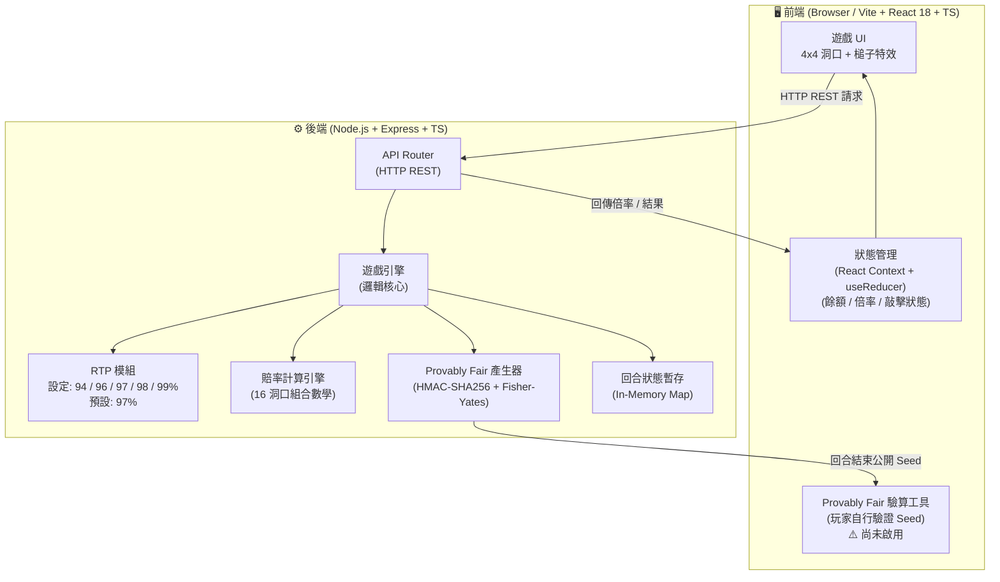
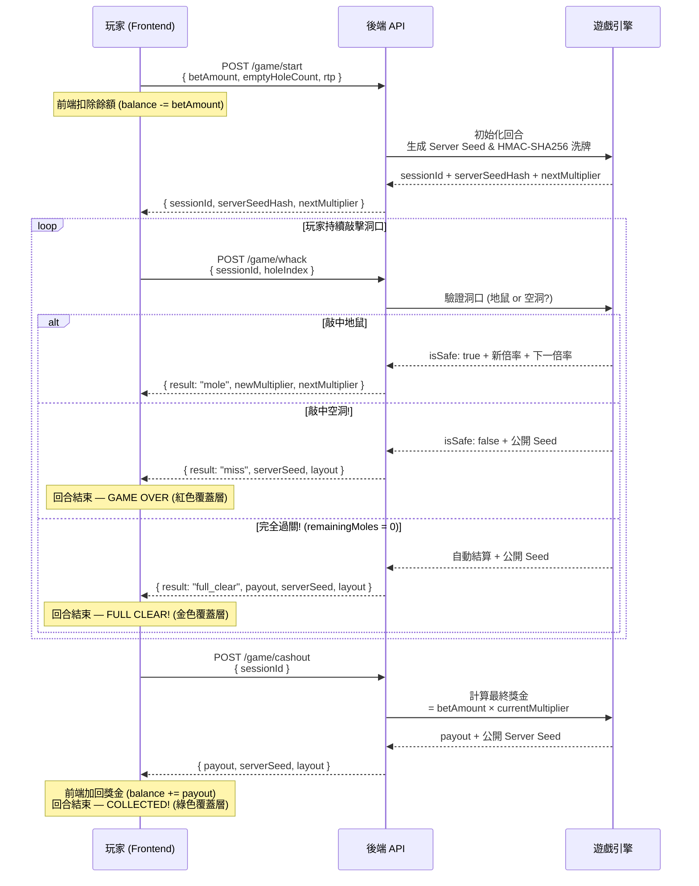

# 打地鼠機率遊戲 (Whack-A-Mole Game) - 專案提案書 (Proposal)

## 1. 專案背景與目標
本專案旨在使用現代化的前後端技術（Vite + React & Node.js），開發一款以經典「打地鼠」為主題的機率遊戲，功能規格精確對標 `mines-game`。
此遊戲的特色為**高透明度 (Provably Fair)** 與 **彈性的回報率設定 (Configurable RTP)**，同時支援整合至大廳單一網址 (`/hitmous-game/`) 及提供行動端 PWA 版本 (`/m/`)。

## 2. 遊戲核心規則
- **網格範圍**：4x4 網格（共 16 個洞口）。
- **難度自訂**：玩家於單局開始前，可選擇 1 到 15 個「空洞 (Empty Holes)」隱藏於 16 個位置中。其餘洞口藏有地鼠。
- **遊玩流程**：
  - **終止與結算條件**：
  1. **兌現 (Cashout)**：玩家可隨時點擊「兌現」按鈕，以目前的獎金倍數結算。結算獎金 = `下注金額 × 目前倍率`。
  2. **完全過關 (Full Clear)**：若玩家成功敲中所有藏有地鼠的洞口，系統將自動以最終最高倍數進行結算。
  3. **敲中空洞 (Whack an Empty Hole)**：遊戲立即結束，**下注金額全數沒收**，獎金歸零。

## 3. 數學模型與可調整機率模組 (RTP)
本專案支援與 Mines Game 相同的**五段式設定機率模組**。
系統將從設定檔讀取全域 RTP (Return to Player) 參數，確保精準控制莊家優勢 (House Edge)。

- **支援的 RTP 設定值**：`94%`, `96%`, `97%`, `98%`, `99%`。
- **目前預設值**：`97%`（RTP 選擇器於 UI 中隱藏，後端仍支援全部五段設定）。

### 📊 賠率 (Multiplier) 計算公式
賠率的計算基於「組合數學 (Combinatorics)」。
- `n` = 總格子數 (16)
- `e` = 空洞數量 (1 ~ 15)
- `d` = 玩家已敲中的地鼠數量

**實際賠率公式**：
`Multiplier = (RTP / 100) * [ C(16, d) / C(16 - e, d) ]`

**倍率顯示精度**：小數點兩位（例：`1.19x`、`2.47x`）。

## 4. 系統技術架構 (Monorepo)
為了兼顧開發效率、部署便利性與安全性，專案劃分為以下兩個核心微服務：

### 4.1 前端 (Frontend)
負責呈現打地鼠的敲擊快感與流暢的物理動畫。
- **核心技術**：Vite + React 18 + TypeScript
- **樣式與 UI**：Vanilla CSS（搭配 CSS Variables 實現 Premium Casino / Dark Mode / Glassmorphism 風格）。
- **狀態管理**：React Context + `useReducer` 管理全域遊戲狀態（含玩家餘額追蹤）。
- **職責**：4x4 洞口渲染、槌子敲擊特效、動態倍率跳動、處理與後端的 HTTP REST API 通訊。
- **整合規格**：
  - **Base URL**：`/hitmous-game/`
  - **Mobile Route**：`/hitmous-game/m/`
  - **PWA**：實作獨立的 Manifest 與離線支援。

### 4.2 後端 (Backend)
負責處理機率、結算邏輯與公平性驗證。
- **核心技術**：Node.js + Express + TypeScript
- **職責**：
  - **Provably Fair 機制**：每局開場生成一組 `Server Seed`，以 HMAC-SHA256 確定性 Fisher-Yates 洗牌地鼠與空洞位置，僅傳送 Hash 給前端。
  - **RTP 引擎**：負責結算贏得的獎金與倍率。
  - **狀態驗證**：防止玩家透過修改請求竄改敲擊結果。

## 5. UI 設計規範

### 5.1 整體佈局
- **風格**：Premium Casino / Dark Mode / Glassmorphism
- **佈局結構**：左右雙欄等高佈局
  - **左欄**：控制面板 (ControlPanel)，寬度 280px，Glassmorphism 卡片樣式
  - **右欄**：遊戲板 (GameBoard)，4x4 洞口網格，最大寬度 520px
- **標題**：「MEGA WHACK」（單行顯示）

### 5.2 控制面板內容
- **面板寬度**：280px，字體放大
- 由上至下依序為：
1. **Account Balance** — 玩家帳戶餘額（美元格式，開局時扣除下注金額，兌現時加回獎金）
2. **Bet Amount** — 下注金額（± 按鈕調整，步進 10，初始值 $100）
3. **Empty Holes** — 空洞數量選擇器（1–15 下拉選單）
4. **Potential Win** — 潛在獲利金額（= 目前倍率 × 下注金額，美元格式）
5. **Action Button** — 依遊戲狀態切換：
   - IDLE → 「Start Game」（綠色）
   - PLAYING → 「Cashout」（綠色，需至少敲中 1 隻地鼠才啟用）
   - GAME_OVER → 「PLAY AGAIN」（綠色）
   - CASHOUT → 「PLAY AGAIN」（綠色）

### 5.3 遊戲結束覆蓋層
- **兌現成功 (CashoutOverlay)**：綠色 Glassmorphism 卡片，顯示「COLLECTED!」、Total Payout 金額（移除 "USD" 字眼）、「PLAY AGAIN」按鈕、「SUCCESS!」文字，綠色粒子效果。
- **完全過關 (FullClearOverlay)**：金色 Glassmorphism 卡片，顯示「FULL CLEAR!」、Total Payout 金額、「PLAY AGAIN」按鈕，金色粒子效果。
- **敲中空洞 (GameOverOverlay)**：紅色 Glassmorphism 卡片，顯示「Miss!」、「Game Over」、實際損失金額（-$betAmount）、「PLAY AGAIN」按鈕、「PLAY AGAIN FOR $XX」文字，紅色粒子效果。

### 5.4 MultiplierDisplay
- 右上角顯示 **Total Multiplier** 數值（移除 "Next" 行，只顯示目前總倍率）。

### 5.5 佈局與字體規範
- **App 佈局**：靠頂部對齊（`justify-content: flex-start`，`padding-top: 24px`），左側面板對齊 `flex-start`
- **控制面板字體**：label 0.8rem、餘額 1.5rem、輸入框 1.1rem、加減按鈕 36px

### 5.6 手機版響應式佈局 (`@media (max-width: 768px)`)
- **佈局方式**：上下堆疊（遊戲板在上、控制面板在下）。
- **間距壓縮**：面板 padding 10px 12px, gap 6px, 按鈕高度 30px, 字體縮小。
- **Overlay 壓縮**：手機版 Overlay 元素尺寸與間距壓縮。

### 5.7 隱藏功能（後端支援，UI 暫不顯示）
- **RTP 選擇器**：後端支援五段 RTP，前端預設使用 97%，選擇器已註解隱藏。
- **Jackpot Bar**：頂部累積大獎顯示，尚未實作，已隱藏。
- **Provably Fair 面板**：Seed Hash 驗證折疊面板（SeedVerifier），尚未啟用，已在前端隱藏（同 RTP Selector 處理方式）。

## 6. 開發階段規劃
1. **Phase 1: 專案初始化與提案審核**
   - 初始化 GitHub Repository。
   - 建立 Vite + Node.js Monorepo 環境（npm workspaces）。
   - 完成 RTP 機率計算 Utils（涵蓋組合數學實作與單元測試）。
2. **Phase 2: 機率演算與後端核心開發** (包含 Provably Fair 邏輯)
   - 實作 Provably Fair (可證明公平) 的生成邏輯。
   - 建立遊戲流程的 API 端點 (Start, Whack, Cashout)。
3. **Phase 3: 前端 UI 與打地鼠特效開發**
   - 建立 Premium Casino Glassmorphism 風格遊戲介面。
   - 實作 React Context + useReducer 狀態機（含餘額追蹤）。
   - 串接後端 API，完成完整遊戲 Lifecycle。
4. **Phase 4: 整合測試與模擬投注驗證**
   - E2E 流程驗證（Vitest 單元測試 + Playwright 截圖）。
   - 在各 RTP 參數下進行大量自動化投注模擬，驗證最終的回報率是否精準貼合設定值。

---

## 7. 系統架構圖



---

## 8. 遊戲流程圖



---

## 8.1 資料結構範例

### 📜 註單記錄 (bet_records)
當玩家在任一面板下注時建立。由於本遊戲支援單局多介面下注，每局遊戲（Session）可對應多筆註單記錄。

```json
{
  "betId": "BET-HITMOUS-20260317-P1",
  "sessionId": "SESSION-HM-88888",
  "playerId": "user_999",
  "panelId": "A",
  "betAmount": 50.00,
  "rtpSetting": 97,
  "volatilityLevel": 3,
  "status": "active",
  "autoCashout": 2.00,
  "createdAt": "2026-03-17T19:30:00.000Z"
}
```

### 🏆 結算記錄 (settlements)
當玩家手動逃跑、觸發自動逃跑或敲中空洞時寫入。

```json
{
  "settlementId": "SETTLE-HITMOUS-20260317-S1",
  "betId": "BET-HITMOUS-20260317-P1",
  "outcome": "win",
  "cashoutMultiplier": 1.85,
  "payout": 92.50,
  "profit": 42.50,
  "settledAt": "2026-03-17T19:35:10.000Z"
}
```

### 🔍 開獎紀錄 (whack_logs)
保存整局遊戲（Session）的最終開獎結果，所有面板共用此紀錄。

```json
{
  "drawId": "WHACK-LOG-20260317-D1",
  "sessionId": "SESSION-HM-88888",
  "crashMultiplier": 5.42,
  "serverSeed": "c3f8e9a2b1d0...",
  "serverSeedHash": "d8e9f2a1...",
  "clientSeed": "player_random_nonce",
  "createdAt": "2026-03-17T19:30:00.000Z",
  "crashedAt": "2026-03-17T19:35:15.000Z"
}
```

---

## 9. RTP 賠率倍率對照表 (範例: 3 個空洞)

> 以下為空洞數量 = 3 的情境（網格 16 洞），分別在不同 RTP 設定下成功敲中 d 個地鼠後的累積倍率。

| 敲中地鼠數 (d) | 公平倍率 (100%) | RTP 99% | RTP 98% | RTP 97% | RTP 96% | RTP 94% |
|:---:|:---:|:---:|:---:|:---:|:---:|:---:|
| 1 | 1.231x | 1.218x | 1.206x | 1.194x | 1.181x | 1.157x |
| 2 | 1.538x | 1.523x | 1.507x | 1.492x | 1.477x | 1.446x |
| 3 | 1.956x | 1.936x | 1.917x | 1.897x | 1.878x | 1.838x |
| 4 | 2.533x | 2.508x | 2.482x | 2.457x | 2.432x | 2.381x |
| 5 | 3.355x | 3.321x | 3.288x | 3.254x | 3.221x | 3.153x |
| 6 | 4.568x | 4.522x | 4.476x | 4.431x | 4.385x | 4.294x |

---

## 10. 市場研究總結
根據對市場上如 Jili Games 或 Dream Tech 的打地鼠遊戲研究：
- **Jili Whack-A-Mole**：偏向射擊/連續點擊型，具備累積大獎 (Jackpot) 機制。
- **Dream Tech Whack-A-Mole**： slot 類型，5x3 結構，RTP 為 97%。
- **本專案差異化**：採用 Pick-to-Win 機制，更具策略性（玩家決定何時停手），且具備最高 99% 的高透明度 RTP，適合追求公平性的玩家。

---

---

## 11. v1.4 更新紀錄 (2026-03-17)

### 資料結構
1. **標準化資料結構**：更新 `bet_records`、`settlements` 與 `whack_logs` 格式，與 `rocketLH` 保持一致。
2. **多面板支援**：註單記錄中新增 `panelId` 並明確註記單局多介面下注支援。

### 前端修正
1. **ControlPanel**：步進值 10、初始下注 $100；面板寬度 280px、字體放大。
2. **App 佈局**：靠頂部對齊（`justify-content: flex-start`）。
3. **MultiplierDisplay**：右上角移除 "Next" 行，只顯示 Total Multiplier。
4. **CashoutOverlay**：移除 "USD" 字眼。
5. **手機版佈局**：上下堆疊（遊戲板在上、控制面板在下），`@media (max-width: 768px)` 響應式切換。
6. **手機版壓縮**：面板 padding 10px 12px, gap 6px, 按鈕 30px, 字體縮小。
7. **手機版 Overlay 壓縮**：元素尺寸與間距壓縮。

### PWA 通用修正
1. Viewport meta：`width=device-width, initial-scale=1.0, maximum-scale=1.0, user-scalable=no, viewport-fit=cover`。
2. 全域 CSS：`100vh` → `100dvh`，`-webkit-text-size-adjust: 100%`。
3. 手機版響應式斷點：`@media (max-width: 768px)`。

### Mockup 截圖
- 桌面版：`apps/hitmous-game/docs/mockups/desktop/hitmous_idle.png`
- 手機版：`apps/hitmous-game/docs/mockups/mobile/hitmous_idle_mobile.png`

---

*文件版本：v1.4 | 日期：2026-03-17*
