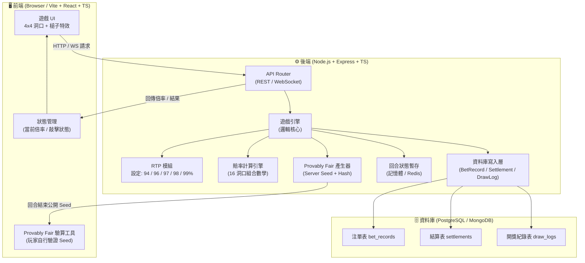
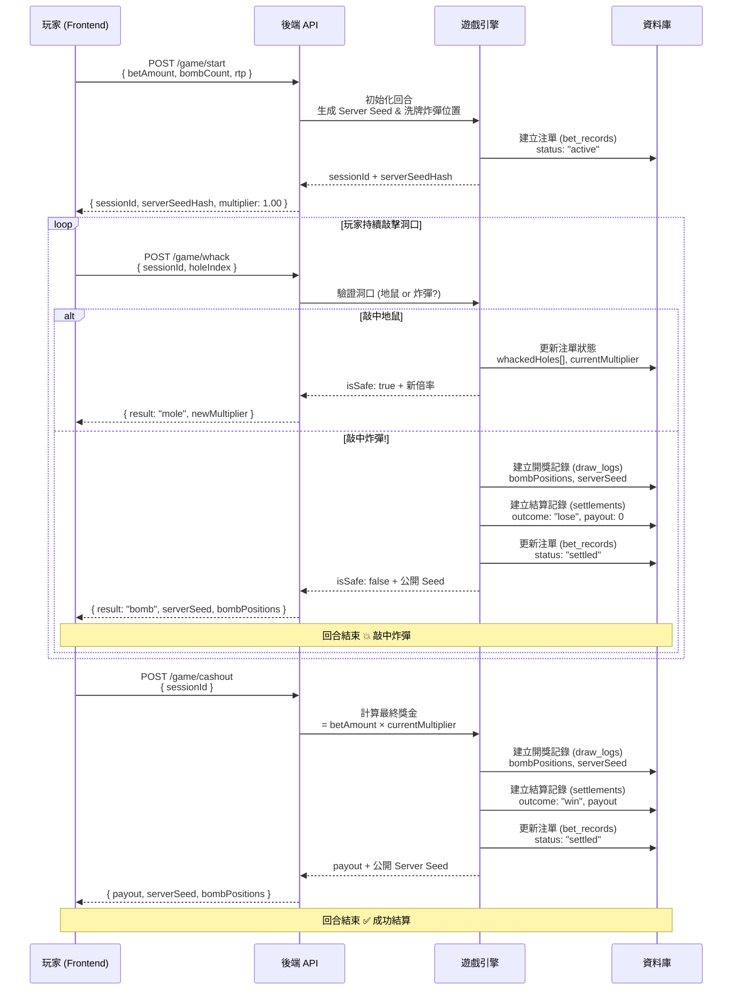

# 打地鼠機率遊戲 (hitmous-game) - 專案提案書 (Proposal)

## 1. 專案背景與目標
本專案參考其 `mines-game` 的高度透明度與機率可控性，旨在開發一款以經典「打地鼠」為主題的機率遊戲。
玩家透過在網格中選擇洞口進行敲擊，若敲中地鼠則獲得獎金倍數，若敲中炸彈或空洞（視難度設定）則遊戲結束。
本專案強調 **Provably Fair (可證明公平)** 機制，並提供 **94% ~ 99% 的可調式 RTP**。

## 2. 遊戲核心規則
- **網格範圍**：4x4 網格（共 16 個洞口）。
- **難度自訂**：玩家於單局開始前，可選擇 1 到 15 個「炸彈」隱藏於洞口中。其餘洞口則藏有地鼠。
- **遊玩流程**：
  - **下注**：設定金額與炸彈數量。
  - **敲擊 (Whack)**：玩家點擊洞口敲擊。
  - **獲利**：若敲中地鼠，目前倍率增加。玩家可隨時點擊「兌現 (Cashout)」結算獎金。
  - **失敗**：若敲中炸彈，遊戲立即結束，下注金額沒收。
  - **全清 (Full Clear)**：敲完所有有地鼠的洞口，自動以最高倍數結算。

## 3. 數學模型與 RTP
與 `mines-game` 類似，倍率計算基於組合數學，並乘以 RTP 系數。

- **支援的 RTP 設定值**：`94%`, `96%`, `97%`, `98%`, `99%`。
- **倍率公式**：
  `Multiplier = (RTP / 100) * [ C(16, d) / C(16 - b, d) ]`
  - `b` = 炸彈數量 (1 ~ 15)
  - `d` = 已成功敲中的地鼠數量

## 4. 系統技術架構
### 4.1 前端 (Frontend)
- **技術**：Vite + React + TypeScript + Vanilla CSS。
- **特色**：高質感的打地鼠動畫、槌子敲擊特效、動態倍率跳動。
- **UI 風格**：現代化遊戲介面，支援深色模式與流暢的微動畫。

### 4.2 後端 (Backend)
- **技術**：Node.js (Express / Fastify) + TypeScript。
- **職責**：
  - **Provably Fair**：使用 Server Seed (AES/SHA-256) 確保地鼠與炸彈位置在開局前已固定。
  - **結算引擎**：嚴格驗證每次敲擊的合法性與倍率計算。
  - **RTP 控制**：統一管理不同營運環境下的機率參數。

## 5. 發展階段
1. **Phase 1: 專案初始化與提案審核** (當前階段)
   - 初始化 GitHub Repository。
   - 建立 Vite + Node.js Monorepo 環境。
   - 完成 RTP 機率計算 Utils（涵蓋組合數學實作與單元測試）。
2. **Phase 2: 機率演算與後端核心開發** (包含 Provably Fair 邏輯)
   - 實作 Provably Fair (可證明公平) 的生成邏輯。
   - 建立遊戲流程的 API 端點 (Start, Pick, Cashout)。
3. **Phase 3: 前端 UI 與打地鼠特效開發**
   - 建立支援 TailwindCSS 的高品質遊戲介面 (Premium UI)。
   - 串接後端 API，完成完整遊戲的 Lifecycle。
4. **Phase 4: 整合測試與模擬投注驗證**
   - E2E 流程驗證。
   - 在各 RTP 參數下進行大量自動化投注模擬，驗證最終的回報率是否精準貼合設定值。

## 6. 系統架構圖



---

## 7. 遊戲流程圖



---

## 7.1 資料庫 JSON 格式範例

### 📜 注單記錄 (bet_records)
```json
{
  "betId": "WHACK-20260313-X1Y2Z3",
  "sessionId": "SESS-wH4cK1nG",
  "playerId": "user_888",
  "betAmount": 50.00,
  "bombCount": 3,
  "rtpSetting": 97,
  "status": "settled",
  "whackedHoles": [0, 5, 10],
  "currentMultiplier": 2.15,
  "serverSeedHash": "b3f9c1e2b84d...",
  "createdAt": "2026-03-13T12:00:00.000Z",
  "updatedAt": "2026-03-13T12:05:30.000Z"
}
```

### 🏆 結算記錄 (settlements)
```json
{
  "settlementId": "SET-WHACK-12345",
  "betId": "WHACK-20260313-X1Y2Z3",
  "outcome": "win",
  "betAmount": 50.00,
  "finalMultiplier": 2.15,
  "payout": 107.50,
  "profit": 57.50,
  "settledAt": "2026-03-13T12:05:30.000Z"
}
```

---

## 8. RTP 賠率倍率對照表 (範例: 3 顆炸彈)

> 以下為炸彈數量 = 3 的情境（網格 16 洞），分別在不同 RTP 設定下成功敲中 d 個地鼠後的累積倍率。

| 敲中地鼠數 (d) | 公平倍率 (100%) | RTP 99% | RTP 98% | RTP 97% | RTP 96% | RTP 94% |
|:---:|:---:|:---:|:---:|:---:|:---:|:---:|
| 1 | 1.231x | 1.218x | 1.206x | 1.194x | 1.181x | 1.157x |
| 2 | 1.538x | 1.523x | 1.507x | 1.492x | 1.477x | 1.446x |
| 3 | 1.956x | 1.936x | 1.917x | 1.897x | 1.878x | 1.838x |
| 4 | 2.533x | 2.508x | 2.482x | 2.457x | 2.432x | 2.381x |
| 5 | 3.355x | 3.321x | 3.288x | 3.254x | 3.221x | 3.153x |
| 6 | 4.568x | 4.522x | 4.476x | 4.431x | 4.385x | 4.294x |
| 7 | 6.471x | 6.406x | 6.342x | 6.277x | 6.212x | 6.083x |
| 8 | 9.615x | 9.519x | 9.423x | 9.327x | 9.231x | 9.038x |

---

## 9. 市場研究總結
根據對市場上如 Jili Games 或 Dream Tech 的打地鼠遊戲研究：
- **Jili Whack-A-Mole**：偏向射擊/連續點擊型，具備累積大獎 (Jackpot) 機制。
- **Dream Tech Whack-A-Mole**： slot 類型，5x3 結構，RTP 為 97%。
- **本專案差異化**：採用 Pick-to-Win 機制，更具策略性（玩家決定何時停手），且具備最高 99% 的高透明度 RTP，適合追求公平性的玩家。
